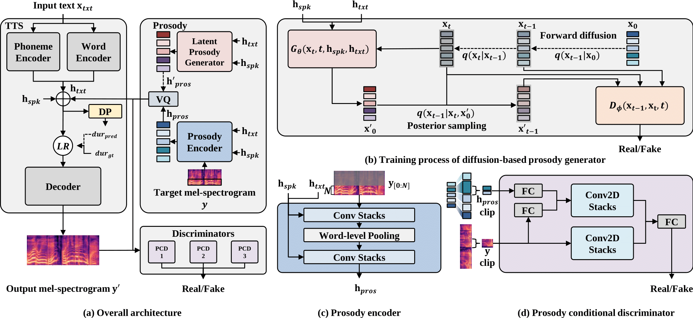

### DiffProsody: Latent Diffusion-based Prosody Generation for Expressive Speech Synthesis with Prosody Conditional Adversarial Training [[Demo](https://diffprosody.github.io/)]

## Abstract

Expressive text-to-speech systems have undergone significant improvements with prosody modeling. However, there is still room for improvement in the conventional prosody modeling methods. Previous studies have used the autoregressive method to predict the quantized prosody vector, which has long-term dependency and slow inference problems. In this paper, we present DiffProsody, which can synthesize expressive speech using a diffusion-based word-level prosody generator and prosody conditional adversarial training. We show that the prosody generator can generate prosody vector and the prosody conditional discriminator can improve the quality of generated speech by reflecting the prosody. Furthermore, we adopted denoising diffusion generative adversarial networks to improve the prosody generation speed. Hence, DiffProsody can generate prosody 16 times faster than the conventional diffusion model. The experimental results demonstrated the superiority of the proposed method.

## Model


## Run

```bash
export PYTHONPATH=.
bash run.sh
```

